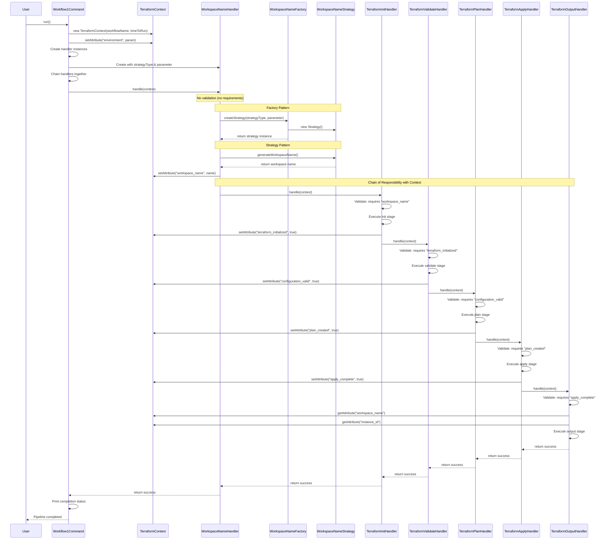
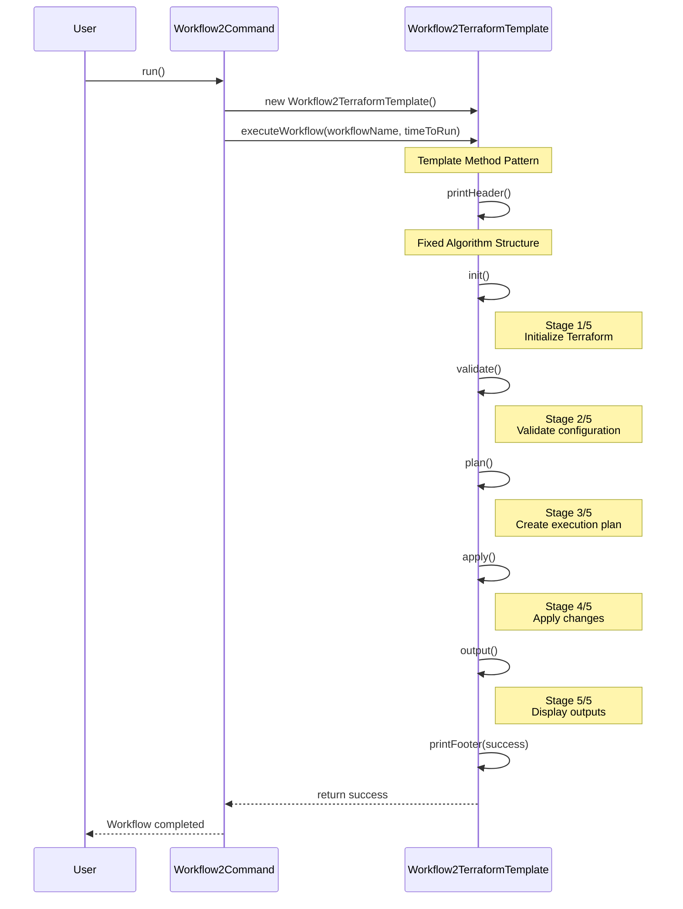
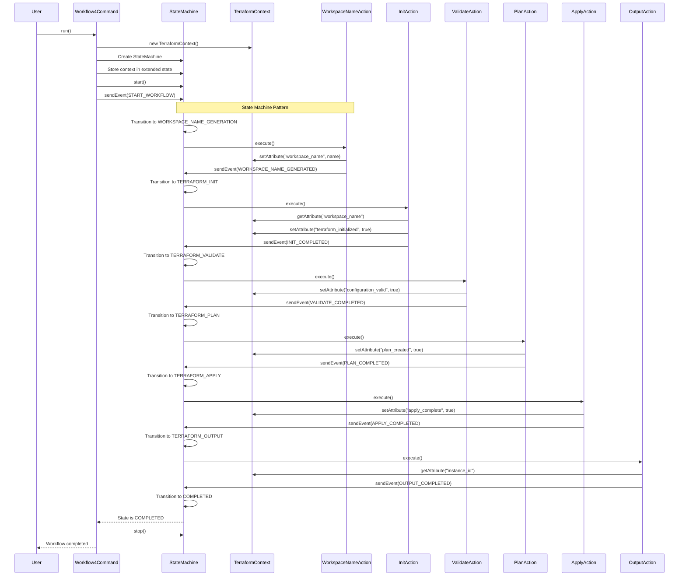
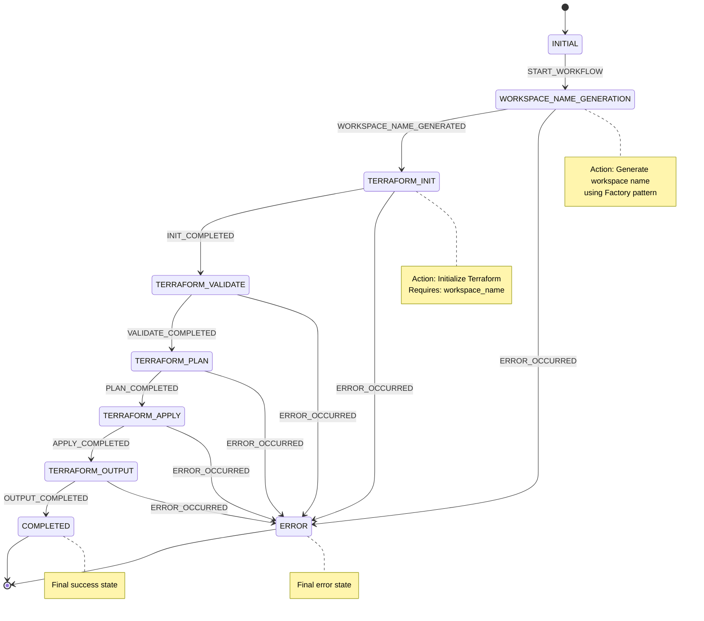
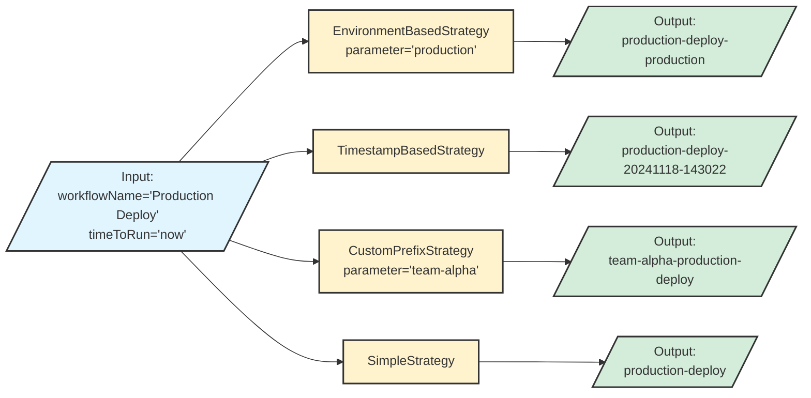
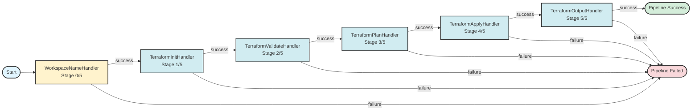
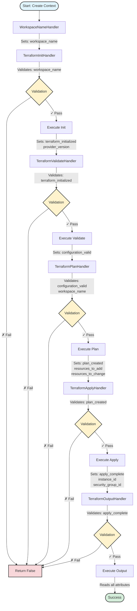

# Architecture Diagrams

This document contains class diagrams and flow diagrams for the Workflow CLI application, illustrating the design patterns used.

## Table of Contents
- [Overall Class Diagram](#overall-class-diagram)
- [Workflow 1 Flow (Chain of Responsibility + Factory + Strategy)](#workflow-1-flow-chain-of-responsibility--factory--strategy)
- [Workflow 2 Flow (Template Method)](#workflow-2-flow-template-method)
- [Workflow 4 Flow (Spring State Machine)](#workflow-4-flow-spring-state-machine)
- [State Machine State Diagram](#state-machine-state-diagram)
- [Factory Pattern Detail](#factory-pattern-detail)
- [Strategy Pattern Detail](#strategy-pattern-detail)

---

## Overall Class Diagram

This diagram shows all the main classes and their relationships across all design patterns.

```mermaid
classDiagram
    %% Commands
    class Workflow1Command {
        -String workflowName
        -String timeToRun
        -StrategyType strategyType
        -String strategyParameter
        +run()
    }
    
    class Workflow2Command {
        -String workflowName
        -String timeToRun
        +run()
    }
    
    class Workflow3Command {
        -String workflowName
        -String timeToRun
        +run()
    }
    
    %% Context Class
    class TerraformContext {
        -String workflowName
        -String timeToRun
        -Map~String,Object~ attributes
        +setAttribute(String, Object)
        +getAttribute(String) Object
        +hasAttribute(String) boolean
        +getAttributeKeys() Set~String~
    }
    
    %% Chain of Responsibility Pattern
    class TerraformHandler {
        <<abstract>>
        #TerraformHandler nextHandler
        +setNext(TerraformHandler) TerraformHandler
        +handle(TerraformContext) boolean
        #doHandle(TerraformContext) boolean*
        #getRequiredAttributes() Set~String~
        #passToNext(TerraformContext) boolean
        #requireAttributes(String...) Set~String~
    }
    
    class WorkspaceNameHandler {
        -StrategyType strategyType
        -String strategyParameter
        -String generatedWorkspaceName
        +handle(String, String) boolean
        +getGeneratedWorkspaceName() String
    }
    
    class TerraformInitHandler {
        +handle(String, String) boolean
    }
    
    class TerraformValidateHandler {
        +handle(String, String) boolean
    }
    
    class TerraformPlanHandler {
        +handle(String, String) boolean
    }
    
    class TerraformApplyHandler {
        +handle(String, String) boolean
    }
    
    class TerraformOutputHandler {
        +handle(String, String) boolean
    }
    
    %% Factory Pattern
    class WorkspaceNameFactory {
        <<factory>>
        +createStrategy(StrategyType, String)$ WorkspaceNameStrategy
        +createStrategy(StrategyType)$ WorkspaceNameStrategy
    }
    
    class StrategyType {
        <<enumeration>>
        ENVIRONMENT
        TIMESTAMP
        CUSTOM_PREFIX
        SIMPLE
    }
    
    %% Strategy Pattern
    class WorkspaceNameStrategy {
        <<interface>>
        +generateWorkspaceName(String, String) String
        +getStrategyDescription() String
    }
    
    class EnvironmentBasedStrategy {
        -String environment
        +generateWorkspaceName(String, String) String
        +getStrategyDescription() String
    }
    
    class TimestampBasedStrategy {
        +generateWorkspaceName(String, String) String
        +getStrategyDescription() String
    }
    
    class CustomPrefixStrategy {
        -String prefix
        +generateWorkspaceName(String, String) String
        +getStrategyDescription() String
    }
    
    class SimpleStrategy {
        +generateWorkspaceName(String, String) String
        +getStrategyDescription() String
    }
    
    %% Template Method Pattern
    class TerraformWorkflowTemplate {
        <<abstract>>
        #String workflowName
        #String timeToRun
        +executeWorkflow(String, String) boolean
        #printHeader()
        #printFooter(boolean)
        #init() boolean*
        #validate() boolean*
        #plan() boolean*
        #apply() boolean*
        #output() boolean*
    }
    
    class Workflow2TerraformTemplate {
        #printHeader()
        #init() boolean
        #validate() boolean
        #plan() boolean
        #apply() boolean
        #output() boolean
    }
    
    %% Relationships - Chain of Responsibility
    TerraformHandler <|-- WorkspaceNameHandler
    TerraformHandler <|-- TerraformInitHandler
    TerraformHandler <|-- TerraformValidateHandler
    TerraformHandler <|-- TerraformPlanHandler
    TerraformHandler <|-- TerraformApplyHandler
    TerraformHandler <|-- TerraformOutputHandler
    
    TerraformHandler o-- TerraformHandler : next
    TerraformHandler --> TerraformContext : uses
    
    %% Relationships - Commands
    Workflow1Command --> WorkspaceNameHandler : creates
    Workflow1Command --> TerraformInitHandler : creates
    Workflow1Command --> TerraformValidateHandler : creates
    Workflow1Command --> TerraformPlanHandler : creates
    Workflow1Command --> TerraformApplyHandler : creates
    Workflow1Command --> TerraformOutputHandler : creates
    
    Workflow2Command --> Workflow2TerraformTemplate : creates
    
    %% Relationships - Factory & Strategy
    WorkspaceNameHandler --> WorkspaceNameFactory : uses
    WorkspaceNameFactory --> WorkspaceNameStrategy : creates
    WorkspaceNameFactory --> StrategyType : uses
    
    WorkspaceNameStrategy <|.. EnvironmentBasedStrategy : implements
    WorkspaceNameStrategy <|.. TimestampBasedStrategy : implements
    WorkspaceNameStrategy <|.. CustomPrefixStrategy : implements
    WorkspaceNameStrategy <|.. SimpleStrategy : implements
    
    WorkspaceNameHandler --> WorkspaceNameStrategy : uses
    
    %% Relationships - Template Method
    TerraformWorkflowTemplate <|-- Workflow2TerraformTemplate
```

---

## Workflow 1 Flow (Chain of Responsibility + Factory + Strategy + Context)

This sequence diagram shows the execution flow of Workflow 1, demonstrating how the Chain of Responsibility, Factory, Strategy patterns work together with context passing and validation.

---

## Workflow 2 Flow (Template Method)

This sequence diagram shows the execution flow of Workflow 2 using the Template Method pattern.

---

## Workflow 4 Flow (Spring State Machine)

This diagram shows the execution flow of Workflow 4 using Spring State Machine pattern.

---

## State Machine State Diagram

This state diagram shows all possible states and transitions in Workflow 4.

---

## Factory Pattern Detail

This diagram shows how the Factory pattern creates different strategies.

---

## Strategy Pattern Detail

This diagram shows how different strategies generate workspace names.

---

## Chain of Responsibility Visualization

This diagram shows the complete handler chain in Workflow 1.

---

---

## Context and Validation Flow

This diagram shows how context attributes are set and validated through the chain.

---

## Design Patterns Summary

### Patterns Used

1. **Chain of Responsibility** (Workflow 1)
   - Handlers: `TerraformHandler` (abstract), `WorkspaceNameHandler`, `TerraformInitHandler`, `TerraformValidateHandler`, `TerraformPlanHandler`, `TerraformApplyHandler`, `TerraformOutputHandler`
   - Purpose: Process Terraform stages sequentially, stopping on failure
   - **Enhancement**: Context passing and input validation

2. **Factory Pattern** (Workflow 1)
   - Factory: `WorkspaceNameFactory`
   - Purpose: Create appropriate workspace naming strategy based on user input

3. **Strategy Pattern** (Workflow 1)
   - Interface: `WorkspaceNameStrategy`
   - Strategies: `EnvironmentBasedStrategy`, `TimestampBasedStrategy`, `CustomPrefixStrategy`, `SimpleStrategy`
   - Purpose: Allow runtime selection of workspace naming algorithm

4. **Template Method Pattern** (Workflow 2)
   - Template: `TerraformWorkflowTemplate` (abstract)
   - Concrete: `Workflow2TerraformTemplate`
   - Purpose: Define fixed algorithm structure with customizable steps

5. **State Pattern** (Workflow 4)
   - States: `TerraformStates` enum
   - Events: `TerraformEvents` enum
   - Actions: One action class per state
   - Configuration: `TerraformStateMachineConfig`
   - Purpose: Model workflow as state transitions

### Pattern Composition

Workflow 1 demonstrates how multiple patterns work together:
- **WorkspaceNameHandler** (part of Chain of Responsibility) uses **WorkspaceNameFactory** (Factory pattern) to create a **WorkspaceNameStrategy** (Strategy pattern)
- **TerraformContext** is passed through the entire chain, allowing handlers to share state
- **Input Validation** ensures each handler has required data before execution
- This shows how design patterns compose to create flexible, maintainable solutions

### Context Object Benefits

The `TerraformContext` provides:
1. **Shared State**: Handlers can store and retrieve data
2. **Type Safety**: Generic `getAttribute()` with type parameter
3. **Validation**: Automatic checking of required attributes
4. **Traceability**: Clear view of all attributes at any stage
5. **Extensibility**: Easy to add new attributes without changing signatures

### Pattern Comparison

| Pattern | Workflow | Approach | Control Flow | Best For |
|---------|----------|----------|--------------|----------|
| **Chain of Responsibility** | Workflow 1 | Handlers linked together | Sequential, passes through chain | Processing pipeline with validation |
| **Template Method** | Workflow 2 | Abstract algorithm, concrete steps | Fixed sequence in template | Algorithm with customizable steps |
| **State Machine** | Workflow 4 | States + Events + Transitions | Event-driven state changes | Complex state management |

All three patterns can achieve the same result - it's about choosing the right tool for your use case!

